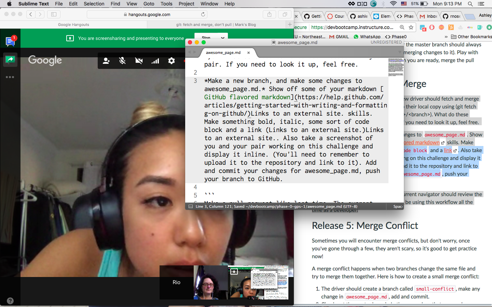

**Switch driver and navigator roles, the new driver should fetch and merge the changes that have been approved to their local copy using (git fetch <remote> <branch>, git merge <remote>/<branch>).** What do these commands do? Discuss with your pair. If you need to look it up, feel free.

*Make a new branch, and make some changes to awesome_page.md.* Show off some of your markdown [GitHub flavored markdown](https://help.github.com/articles/getting-started-with-writing-and-formatting-on-github/)Links to an external site. skills. Make something bold, italic, some sort of code block and a link (Links to an external site.)Links to an external site.. Also take a screenshot of you and your pair working on this challenge and display it inline. (You'll need to remember to upload it to the repository and link to it). Add and commit your changes for awesome_page.md, push your branch to GitHub.

```
Make a pull request like last time. The current navigator should review the diff of the request and merge it. You will be using this workflow all the time as a developer!
```


